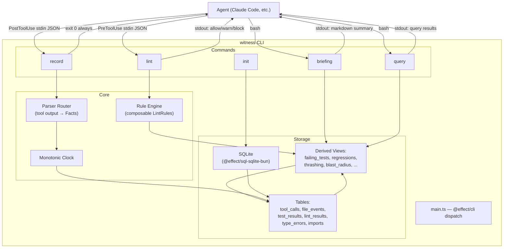

# Architecture

## System Overview

Witness is a real-time behavioral linter for AI coding agents. It hooks into an agent's tool call lifecycle (PreToolUse / PostToolUse) to intercept, evaluate, and record every action the agent takes. The linter uses an append-only SQLite fact store and derived SQL views to detect bad workflow patterns — editing without reading, thrashing on a file, committing with failing tests, drifting out of scope.

It is **not** a general-purpose memory system. The fact store exists to make the linter stateful. The SQL views exist to derive lint conditions. The briefing exists to surface lint state. Everything serves the linter.

**Single binary**: `bun run src/main.ts <command>`

## Component Diagram



## Data Flow

### PreToolUse Path (lint)

```
tool call → stdin JSON → parse HookInput → route to applicable rules
  → each rule: SELECT from indexed SQL view → return violation or null
  → collect results → format response:
      no violations  → exit 0, no output (allow)
      warn violations → exit 0, JSON with additionalContext
      block violation → exit 0, JSON with permissionDecision: deny
```

Latency budget: **<30ms**.

### PostToolUse Path (record)

```
tool call + output → stdin JSON → parse HookInput
  → route to parser by tool_name + command pattern
  → parser extracts Fact[] (file events, test results, imports, etc.)
  → Clock.tick() for each fact
  → INSERT facts into SQLite tables
  → SQL views auto-update
  → exit 0 always
```

Latency budget: **<50ms**. If parsing fails, log to stderr and exit 0. Never crash.

## Storage Layer

### Tables

| Table | Purpose | Key Columns |
|-------|---------|-------------|
| `tool_calls` | Raw log of every tool invocation | `t`, `session_id`, `tool_name`, `tool_input`, `tool_output` |
| `file_events` | Read / edit / create / delete events | `t`, `session_id`, `event`, `file_path` |
| `test_results` | Individual test outcomes | `t`, `session_id`, `test_name`, `outcome`, `message` |
| `lint_results` | Code lint/style findings | `t`, `session_id`, `file_path`, `line`, `rule`, `severity` |
| `type_errors` | Type checker output | `t`, `session_id`, `file_path`, `line`, `message` |
| `imports` | Source → imported module edges | `t`, `session_id`, `source_file`, `imported_module` |

Every row has:
- `t` — monotonic logical clock (integer, session-scoped)
- `ts` — wall clock timestamp (for cross-session queries)
- `session_id` — UUID scoping facts to a single agent session

### Derived Views

Views are the core of the linter. They compute lint conditions from raw facts.

| View | Derives | Used By |
|------|---------|---------|
| `current_test_state` | Latest outcome per test name | `no_commit_failing`, `fix_regressions_first` |
| `failing_tests` | Tests currently failing | `no_commit_failing` |
| `regressions` | Tests passing before an edit, failing after | `fix_regressions_first` |
| `thrashing` | Files edited 3+ times with failures persisting | `no_thrashing` |
| `edits_since_last_test` | Count of edits since last test run | `test_after_edits`, `no_pointless_rerun` |
| `edited_but_unread` | Files edited without prior read in session | `no_edit_unread` |
| `depends_on` | Transitive import closure (recursive CTE) | `scope_check`, blast radius queries |
| `blast_radius` | Files depending on recently edited files | `scope_check` |
| `error_clusters` | Tests sharing same failure message | briefing |
| `likely_fixes` | Edits followed by test fail→pass | briefing, query |
| `untested_edits` | Files edited but not tested since | `test_after_edits` |

## Hook Protocol

### PreToolUse (lint command)

**Input** (stdin):
```json
{
  "hook": "PreToolUse",
  "tool_name": "Edit",
  "tool_input": {
    "path": "src/auth.ts",
    "old_text": "...",
    "new_text": "..."
  }
}
```

**Output** (stdout):

Allow (no output, exit 0):
```
```

Warn (exit 0):
```json
{
  "decision": "approve",
  "additionalContext": "[witness] ⚠️ no_edit_unread: src/auth.ts has not been read this session. Read it first to understand the current state."
}
```

Block (exit 0):
```json
{
  "hookSpecificOutput": {
    "hookEventName": "PreToolUse",
    "permissionDecision": "deny",
    "permissionDecisionReason": "[witness] 🛑 no_thrashing: src/auth.ts has been edited 4 times with test failures persisting. Stop and reconsider your approach."
  }
}
```

### PostToolUse (record command)

**Input** (stdin):
```json
{
  "hook": "PostToolUse",
  "tool_name": "Edit",
  "tool_input": { "path": "src/auth.ts", "..." : "..." },
  "tool_output": "File edited successfully",
  "tool_exit_code": 0
}
```

**Output**: None. Exit 0 always. Never crash, never block.

## Performance Constraints

| Hook | Budget | Strategy |
|------|--------|----------|
| PreToolUse (lint) | <30ms | Bun cold start ~15ms. Rules are simple SELECTs on indexed views. |
| PostToolUse (record) | <50ms | INSERT + parser. JSON parse is the bottleneck. |

If either exceeds budget, degrade silently (exit 0, no output) rather than blocking the agent.

## Technology Stack

| Layer | Choice | Why |
|-------|--------|-----|
| Runtime | Bun | Fast cold start (~15ms). Hooks must not add latency. Native SQLite. |
| SQL | `@effect/sql-sqlite-bun` | Tagged template literals, connection management, type-safe. |
| CLI | `@effect/cli` | Subcommands with typed args. Single entrypoint. |
| Effects | Effect | Typed error channels, scoped resources, composable rules, testable layers. |
| Platform | `@effect/platform-bun` | Stdin stream, filesystem, process args. |

## Directory Structure

```
witness/
├── docs/                     # Project documentation (you are here)
├── src/
│   ├── main.ts               # @effect/cli entrypoint, subcommand dispatch
│   ├── Db.ts                 # SqliteClient.layer configuration
│   ├── Schema.ts             # DDL + views as Effect
│   ├── Facts.ts              # Fact types (tagged unions)
│   ├── Clock.ts              # Monotonic tick via SQL
│   ├── commands/
│   │   ├── Init.ts           # init subcommand
│   │   ├── Record.ts         # record subcommand (PostToolUse)
│   │   ├── Lint.ts           # lint subcommand (PreToolUse)
│   │   ├── Briefing.ts       # briefing subcommand
│   │   └── Query.ts          # query subcommand + named queries
│   ├── rules/
│   │   ├── Rule.ts           # LintRule interface
│   │   ├── NoEditUnread.ts
│   │   ├── FixRegressionsFirst.ts
│   │   ├── TestAfterEdits.ts
│   │   ├── NoThrashing.ts
│   │   ├── NoCommitFailing.ts
│   │   ├── NoPointlessRerun.ts
│   │   ├── ScopeCheck.ts
│   │   └── index.ts          # all rules array
│   └── parsers/
│       ├── Parser.ts         # Router: tool_name + pattern → parser
│       ├── file.ts           # File event extraction
│       ├── pytest.ts          
│       ├── jest.ts            
│       ├── go.ts              
│       ├── cargo.ts           
│       ├── eslint.ts          
│       ├── tsc.ts             
│       └── index.ts          # Router implementation
├── test/
│   ├── helpers/              # DB test layer, fixture loaders, seed helpers
│   └── ...                   # Test files mirroring src/ structure
├── fixtures/                 # Sample tool outputs for parser tests
├── AGENTS.md                 # Agent instructions
├── CLAUDE.md                 # → AGENTS.md symlink
└── package.json
```
